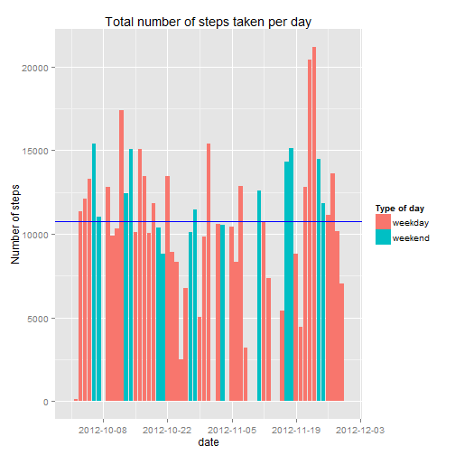
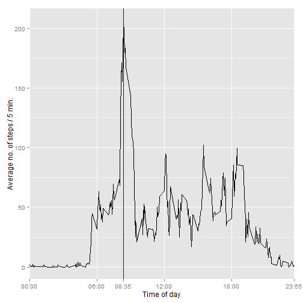
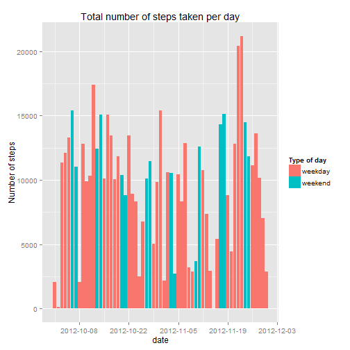
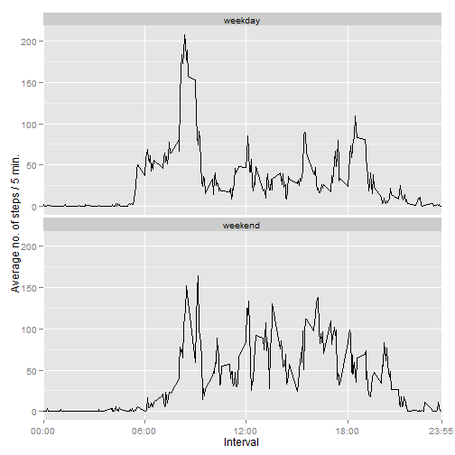

# Reproducible Research: Peer Assessment 1


```r
Sys.setlocale("LC_TIME", "English")
```

```
## [1] "English_United States.1252"
```

```r
require(plyr)
require(ggplot2)
```

## Loading and preprocessing the data
First unzip and read the the csv-file, and extract day of week from the date


```r
if(!file.exists("activity.csv"))
    unzip("activity.zip")

data <- read.table("activity.csv",sep=",", head=T, 
                   colClasses=c("integer","Date", "integer"))
data <- transform(data, dayofweek= factor(weekdays.Date(date),
                                          levels=c("Monday", "Tuesday", 
                                                   "Wednesday","Thursday",
                                                   "Friday", "Saturday",
                                                   "Sunday")))
```

## What is mean total number of steps taken per day?
First create a summary dataset summing the number of steps per day. Visualize 
in a histogram. Also, calculate the average number of steps per day. To get it
right, we don't want to count "all N/A days", so sum both with and without NAs


```r
summed <- ddply(data, .(date), summarize,
                totalsteps.na=sum(steps),
                totalsteps= sum(steps,na.rm=T))

## calculate average without the NA days
average <- mean(summed$totalsteps.na,na.rm=T)

## to help visualize, indicate weekends
summed <- transform(summed, isweekend=weekdays.Date(date) %in% c("Saturday", "Sunday"))

## make the histogram
ggplot(summed, aes(x=date, y=totalsteps, fill=isweekend))+
    geom_histogram(stat="identity")+
    ylab("Number of steps")+
    ggtitle("Total number of steps taken per day")+
    geom_hline(aes(yintercept=average), color="blue")+
    scale_x_date(breaks = "2 week")+
    scale_fill_discrete(name="Type of day", labels=c("weekday", "weekend"))
```

 

The daily average number of steps is:

```r
average
```

```
## [1] 10766
```

## What is the average daily activity pattern?
For the 61 days, calculate the average for each 5-minute interval and plot the
time series. Determine the most active 5-minute interval.


```r
## First group by interval and find the mean
pattern <- ddply(data, .(interval), summarize, steps=mean(steps, na.rm=T))

## find the interval with the maximal number of steps
maxix <- which.max(pattern$steps)
maxInterval <- pattern[maxix,]$interval
maxSteps <- pattern[maxix,]$steps

## Help visualize the intervals 
xbreaks <- c(0,600,1200,1800,2355, maxInterval)
xlabs <- sprintf("%02d:%02d", xbreaks%/%100, xbreaks%%100)

## make a line plot
ggplot(pattern, aes(x=interval, y=steps))+
    geom_line()+
    geom_vline(aes(xintercept=maxInterval),color="blue")+
    scale_x_discrete("Time of day", 
                    breaks=xbreaks, 
                    labels=xlabs)+
    ylab("Average no. of steps / 5 min.")
```

 

The maximum number of steps per 5-minute interval is 206 
and occurs in the interval starting at 08:35. 

## Imputing missing values
There are missing values in the dataset.

```r
sum(!complete.cases(data))
```

```
## [1] 2304
```

To compensate for any bias, these missing values may bring to the analysis, the 
following strategy is used to fill these missing values:
Use the median for each 5-minute interval sampled from the same day of the week as
the day with the missing value. Use of the median in stead of the mean, supresses 
"extreme" outlier values.


```r
medianvalues <- ddply(data, .(dayofweek, interval), summarize, 
                      mediansteps=median(steps, na.rm=T))

merged <- merge(data, medianvalues, by=c("dayofweek", "interval"))
merged <- merged[with(merged, order(date, interval)),]
imp.data <- data
imp.data$steps <- ifelse(is.na(merged$steps), merged$mediansteps, merged$steps)
```

To make sure the new dataset, imp.data, is indeed complete, count the number of
incomplete cases


```r
sum(!complete.cases(imp.data))
```

```
## [1] 0
```

Finally plot the new dataset and find mean and median values for the total number
of steps taken each day


```r
imp.summed <- ddply(imp.data, .(date), summarize, totalsteps=sum(steps))
imp.summed <- transform(imp.summed, typeofday=factor(
    ifelse(weekdays.Date(date) %in% c("Saturday", "Sunday"),"weekend","weekday")))

## Calculate mean and median
imp.mean <- round(mean(imp.summed$totalsteps),0)
imp.median <- round(median(imp.summed$totalsteps),0)

ggplot(imp.summed, aes(x=date, y=totalsteps, fill=typeofday))+
    geom_histogram(stat="identity")+
    ylab("Number of steps")+
    ggtitle("Total number of steps taken per day")+
    scale_x_date(breaks="2 week")+
    scale_fill_discrete(name="Type of day")
```

 

Mean number of steps per day after imputing: 

```r
imp.mean
```

```
## [1] 9705
```
Median number of steps per day after imputing: 

```r
imp.median
```

```
## [1] 10395
```

## Are there differences in activity patterns between weekdays and weekends?
Using a factor variable "typeofday" indicating either weekday or weekend,
make a plot showing the time series plot of average number of steps per interval
for week days and weekends respectively


```r
imp.data <- transform(imp.data, typeofday=factor(
    ifelse(weekdays.Date(date) %in% c("Saturday", "Sunday"),"weekend","weekday")))
daytype.summed <- ddply(imp.data, .(typeofday, interval), summarize, avgnosteps=mean(steps))

xbreaks<-c(0,600,1200,1800,2355)
xlabs <- c("00:00", "06:00", "12:00","18:00", "23:55")

ggplot(daytype.summed, aes(x=interval, y=avgnosteps))+
    geom_line()+
    scale_x_discrete("Interval", 
                    breaks=xbreaks, 
                    labels=xlabs)+
    ylab("Average no. of steps / 5 min.")+
    facet_wrap(~ typeofday, ncol = 1)
```

 
